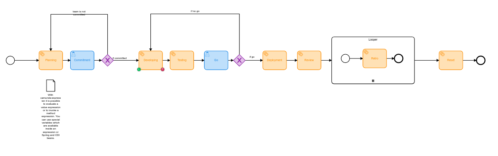

# Camunda Toolkit
<!--- These are examples. See https://shields.io for others or to customize this set of shields. You might want to include dependencies, project status and licence info here --->


<!---->

Camunda toolkit serves as my personal open source process engine toolkit. It may help other developer as well with a lot
of examples, descriptions and insights.

The toolkit provides some demo processes, camunda api examples, my personal best practices, notes and how tos. Yes, even
a playground where you can try out all kinds of different camunda things. I love playgrounds. It aims to make it easier
to develop.

## Installing camunda toolkit

To install the toolkit, follow these steps:

Linux, Windows, i0S with java 11:

    1. git clone https://github.com/mab9/camunda-toolkit.git
    2. mvn clean package -DskipTests

To be able to use the full potential of this toolkit, you will have to install the camunda modeler as well! The modeler
will provide you a GUI to checkout the demo processes and even developer your own BPMNs.
Follow [these](https://docs.camunda.org/get-started/quick-start/install/#camunda-modeler) descriptions to install the
modeler.

## Some examples and how tos

### The demo process

Yey, this project method is tough. An agile development process that is modeled with BPMN. The process uses several
frequently applied features of camunda.



This bpmn shows the development process that uses following features:

- external task for heavy work like process big files
- user task for user interactions
- service tasks for short computer work like doing a request
- gateways
- listeners, delegators, expressions and more
- Looper kind of for each execution
- test framework

The development process demonstrates the use of those features and can be used as playground. Do some funny stuff, test
how features work, do analyzes and so one. Feel free.

### Run demo process

Follow these steps to run the engine with the demo processes:

    1. mvn spring-boot:run
    2. invoke http://localhost:8080
    3. Login with credential defined in the application.yaml (id, password)

### Extend the demo process

### How to use the playground

- demo development process
- install camunda modeler to have a look on the demo bpmn.
- check out the task config via camunda modeler
- run the demo process, do what you want! maybe create a new branch and do your tests

**Example: cmdanalyse lists the most used commands (possible aliases or workflow improvements)**

### My gathered best practices

- use accessor pattern to handle variables
  - if not needed, do not hold complex objects within the scope
  - add link to camunda doc.
- external task to handle long runnings -> config external tasks with listeners or input vars
- use only one method to configure your tasks. its not a good idea to have define some config varia bles within a
  listener others into a delegator and more via input method.
- best approach to implement / develop processes
  - do not misuse delegators. delegators are no services that handle heavy work!
  - test your process!
  - don't make your work dependent on a working process!
  - implement your process in one peace. no incremental development! This does not mean, that you should not edit or
    extend your process.
  - handle flow variable and separate them from others.
  - ...?

```
md cmdanalyse
 
     50 git status 
     41 exit  
     27 c  
     26 ls  
     ...
```

With this core function, you may decide to write an alias or improve your dev workflow with a self written plugin.

## Contributing to Camunda Toolkit

<!--- If your README is long or you have some specific process or steps you want contributors to follow, consider creating a separate CONTRIBUTING.md file--->
To contribute to md, follow these steps:

1. Fork this repository.
2. Create a branch: `git checkout -b <branch_name>`.
3. Make your changes and commit them: `git commit -m '<commit_message>'`
4. Push to the original branch: `git push origin camunda-toolkit/<location>`
5. Create the pull request.

Alternatively see the GitHub documentation
on [creating a pull request](https://help.github.com/en/github/collaborating-with-issues-and-pull-requests/creating-a-pull-request)
.

## My next ideas

- Add external task usage example
- Add accessor pattern example to handle the variable scope
-

## Contributors

Thanks to the following people who have contributed to this project:

* [@mab9](https://github.com/mab9) 📖

<!-- You might want to consider using something like the [All Contributors](https://github.com/all-contributors/all-contributors) specification and its [emoji key](https://allcontributors.org/docs/en/emoji-key). -->

## Contact

If you want to contact me you can reach me at **marcantoine.bruelhart@gmail.com.**

## License

<!--- If you're not sure which open license to use see https://choosealicense.com/--->

This project uses the following license: [GNU GPLv3](https://choosealicense.com/licenses/gpl-3.0/).


