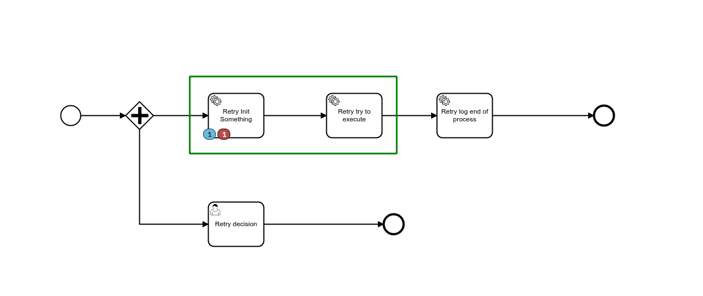
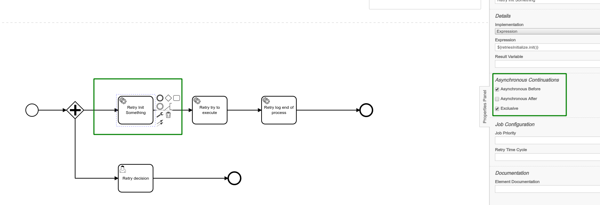

# Retries config and transaction demo

This process shall demonstrate how retries and transaction may be used.

## Setup of the demo

The demo consist of 3 service task which the first two are executed in the same transaction. The third and last service
task is to show the end of the process. Then there is a human task, that is used to set a variable 'processDone', that
enables the second service task to succeed.

As long the 'processDone' variable is set to false, the second service task will fail. Thethe process will raise an
incident and go back to the beginning of the transaction. In this case, the first service task.

The jumps to the beginning of the transaction is visible within the server log.

## Retries

https://docs.camunda.org/manual/latest/user-guide/process-engine/the-job-executor/#retry-intervals

## Transactions

Transactions may be configured as shown below on the image:

The transaction start, begins before the service task starts. The transaction end, ends the transaction right after the
execution of the service task. In this case the transaction stays alive, since there is no transaction end defined.

